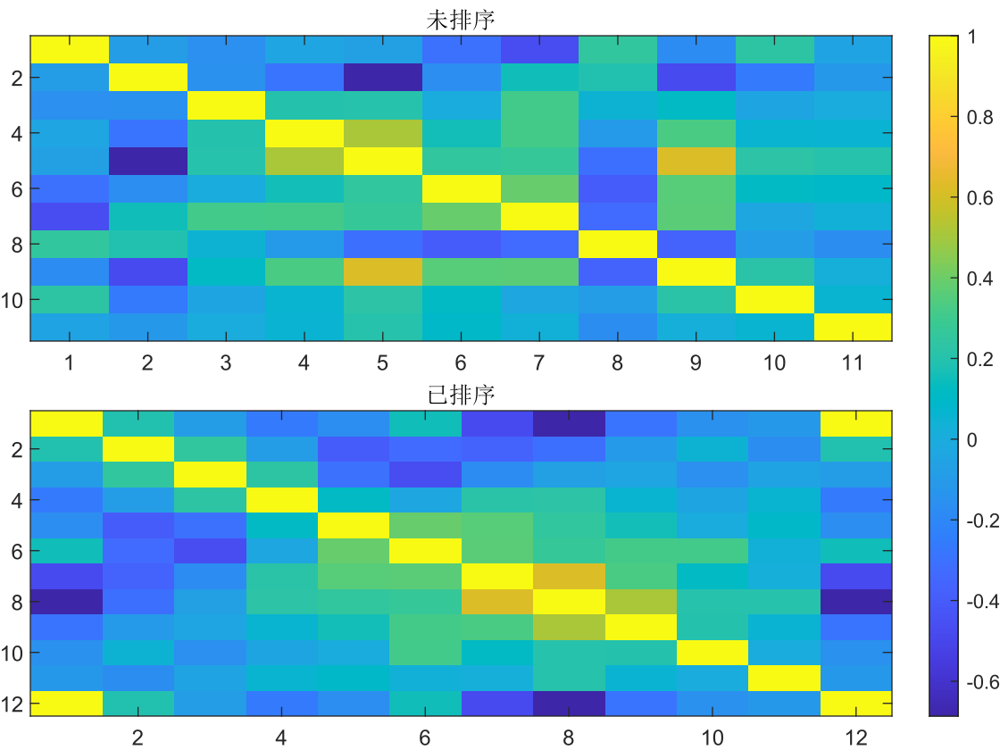
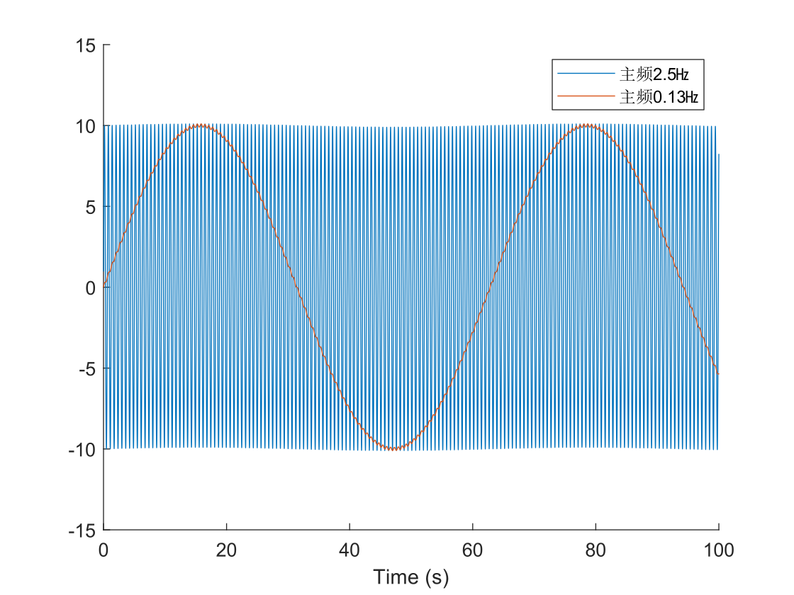

埃博拉酱的MATLAB数据操纵工具包，提供一系列MATLAB内置函数所欠缺，但却常用的增强功能

本项目的发布版本号遵循[语义化版本](https://semver.org/lang/zh-CN/)规范。开发者认为这是一个优秀的规范，并向每一位开发者推荐遵守此规范。
# 目录
- [ArrayBuilder<handle（MATLAB类）](#ArrayBuilder<handle（MATLAB类）)：数组累加器
- [CorrelationMatrixSort](#CorrelationMatrixSort)：对相关性矩阵进行排序，使得相关性高的个体尽可能彼此接近
- [DivideEquallyOnDimensionsIntoCells](#DivideEquallyOnDimensionsIntoCells)：将一个数组沿指定多个维度尽可能均等地拆分到多个元胞中
- [DelimitedStrings2Table](#DelimitedStrings2Table)：将一列分隔符字符串的前几个字段读出为表格或时间表
- [IntegralSplit](#IntegralSplit)：将一个大整数拆分成尽可能相等的多个小整数之和
- [MainFrequency](#MainFrequency)：计算信号的主频
- [MaxSubs](#MaxSubs)：返回数组的最大值以及所在的坐标。
- [MeanSem](#MeanSem)：一次性高效算出数据沿维度的平均值和标准误。
- [MinSubs](#MinSubs)：返回数组的最小值以及所在的坐标。
- [StructAggregateByFields](#StructAggregateByFields)：对结构体的每个字段执行累积运算，累积结果放在一个字段相同的结构体标量中返回。
- [SuperCell2Mat](#SuperCell2Mat)：cell2mat的升级版
# ArrayBuilder<handle（MATLAB类）
数组累加器

将数据向内存中积累时，经常遇到需要不断累加数组的问题，MATLAB会提示预分配内存。但如果读取之前无法得知将会有多少项，预分配就会变成一个十分麻烦的动态任务。本类建立一个增长维度，在此维度上可以不断累加一个内置的数组。用户只需不断Append即可，无需考虑内存分配的问题，本类会自动进行优化的内存管理。
```MATLAB
%构造一个沿第1维度累加的数组
Ab=ArrayBuilder(1);
%重复累加
for a=1:3
  Ab.Append(randi([0 9],randi([0 3]),3));
end
Ab.Harvest
%继续累加
for a=1:3
  Ab.Append(randi([0 9],randi([0 3]),3));
end
Ab.Harvest
%{
ans =

     8     3     4
     8     2     9
     0     8     1
     1     1     8
     5     8     3
     1     6     5


ans =

     8     3     4
     8     2     9
     0     8     1
     1     1     8
     5     8     3
     1     6     5
     0     2     1
     //数据随机生成，每次运行可能不同
%}
```

构造参数：BuildDimension(1,1)uint8=1，累加维度。数组的这个维度将不断累加增长，其它维度将由第一次Append决定，以后不再改变。
## 只读属性
BuildDimension(1,1)uint8，累加维度

Stock(1,1)uint32，当前在累加维度上的累加数
## 成员方法
### Append
向数组累加新内容

输入参数：New，要累加的内容。第一次可以累加任意内容，以后累加内容可以和第一次在累加维度上尺寸不一致，其它维度必须尺寸一致。
### Harvest
收获累加完毕的MATLAB数组。收获后可以释放本对象，也可以继续累加。

返回值：Array，累加完毕的MATLAB数组。
# CorrelationMatrixSort
对相关性矩阵进行排序，使得相关性高的个体尽可能彼此接近

相关性矩阵是一个正方形矩阵，可由corrcoef函数得到，表征多维数据个体之间的线性相关性。相关性矩阵的主对角线上所有值均为1，表示每个个体与自身绝对相关。其它值代表编号为该值所在行和所在列的两个个体之间的相关性。相关性矩阵可以作热图，但如果相关性高的个体不能在图上相互靠近成一个群体，就难以通过肉眼从相关热图上分辨出群体。因此需要对相关矩阵进行排序，将相关性高的个体尽可能凑在一起。
```MATLAB
load("CorrelationMatrix.mat");
tiledlayout("flow",TileSpacing="tight",Padding="tight");
nexttile;
imagesc(CorrelationMatrix);
title("未排序");
%未排序的相关热图，看起来眼花缭乱，很难分辨出高相关群体
nexttile;
[SortIndex,SortedCM]=CorrelationMatrixSort(CorrelationMatrix);
imagesc(SortedCM);
title("已排序");
%排序后，高相关的群体聚集在一起，并且可以显示排序序号
CB=colorbar;
CB.Layout.Tile="east";
SortIndex
```

## 输入参数
CM(:,:)，未排序的相关矩阵，必须是正方形
## 返回值
SortedIndex(:,1)double，排序编号，以个体在原矩阵中的位置为索引的排序，即SortedCM=SortedCM(SortIndex,SortIndex)。

SortedCM(:,:)，排序后的矩阵
# DivideEquallyOnDimensionsIntoCells
将一个数组沿指定多个维度尽可能均等地拆分到多个元胞中
```
>> DivideEquallyOnDimensionsIntoCells(rand(3,3,3),2,2)

ans =

  1×2 cell 数组

    {3×1×3 double}    {3×2×3 double}
```
## 输入参数
Array，要拆分的数组

Dimensions(1,:)uint8，要拆分哪些维度

NoDivisions(1,:)uint8，每个维度拆成几份，顺序与Dimensions一一对应
## 返回值
Array cell，拆分后的元胞数组。如果维度尺寸是拆分数的整倍数，将均等拆分；如果不整倍，则将尽可能均等，各分块尺寸最多相差1。
# DelimitedStrings2Table
将一列分隔符字符串的前几个字段读出为表格或时间表

分隔符字符串列如下形式：
```
4003.20210204.BlueBase.All.10%400V_0002.Registered.Measurements.mat
4003.20210204.BlueBase.PV.10%400V_0002.Registered.Measurements.mat
4003.20210204.GreenRef.All.10%400V_0005.Registered.Measurements.mat
4003.20210204.GreenRef.PV.10%400V_0005.Registered.Measurements.mat
```
每行一个字符串，字符串用特定的符号分割成了一系列字段。如果前几个字段有固定的意义且在所有字符串中都存在，则可以将它们读出成表。如果某个字段是时间，还可以读出成时间表。
```MATLAB
Strings=["4003.20210204.BlueBase.All.10%400V._0002.Registered.Measurements.mat"
"4003.Registered.Measurements.20210204.BlueBase.PV.10%400V._0002.mat"
"4003.20210204.Measurements.GreenRef.All.10%400V._0005.Registered.mat"
"Measurements.4003.Registered.20210204.GreenRef.PV.10%400V._0005.mat"];
%忽略"Registered"和"Measurements"两个无关关键词后，第2个字段始终是日期，其他字段分别具有各自的意义：
Table=DelimitedStrings2Table(Strings,["Mouse" "Experiment" "CellGroup" "Condition" "TrialNumber"],".",TimeField=2,IgnoreKeywords=["Registered" "Measurements"])
%{
Table =

  4×5 timetable

       Time       Mouse     Experiment    CellGroup    Condition    TrialNumber
    __________    ______    __________    _________    _________    ___________

    2021-02-04    "4003"    "BlueBase"      "All"      "10%400V"      "_0002"  
    2021-02-04    "4003"    "BlueBase"      "PV"       "10%400V"      "_0002"  
    2021-02-04    "4003"    "GreenRef"      "All"      "10%400V"      "_0005"  
    2021-02-04    "4003"    "GreenRef"      "PV"       "10%400V"      "_0005"  
%}
```
## 必需参数
Strings(:,1)string，分隔符字符串列

FieldNames(1,:)string，从头开始按顺序排列每个字段的名称。如果有时间字段或被忽略的关键字段，直接跳过，不要在FieldNames里指示，也不要留空，而是直接将后面的字段提前上来。

Delimiter(1,1)string，分隔符，将传递给split用于分隔。
## 名称-值参数
TimeField(1,1)uint8=0，时间字段在字符串中是第几个字段，被忽略的字段不计入该序号。如果设为0，则没有时间字段，返回普通表；否则返回时间表。

DatetimeFormat(1,:)char='yyyyMMddHHmmss'，日期时间格式。不支持含有分隔符的日期时间格式，时间字段字符串必须全为日期时间数字，如"20210306", "202103061723"等。如果实际的字段长度不足，将会自动截短格式字符串以匹配之。将作为datetime函数的InputFormat参数。时间字段在所有字符串之间不需要长度相同。如果TimeField为0，将忽略该参数。

IgnoreKeywords(1,:)string，如果分隔出的字段正好是某些关键词，忽略它们，不会被读出为字段，也不计入位置编号。如果时间字段出现在被忽略的字段之后，每有一个忽略字段，TimeField都应当-1。
## 返回值
Table(:,:)，如果TimeField为0，返回table，否则返回timetable。
# IntegralSplit
将一个大整数拆分成尽可能相等的多个小整数之和
```
>> IntegralSplit(10,3)

ans =

  3×1 uint8 列向量

   3
   4
   3
```
## 输入参数
Sum(1,1)uint8，要拆分的大整数

NoSplits(1,1)uint8，拆分的份数
## 返回值
Parts(:,1)uint8，拆分后的小整数，其和等于大整数。如果Sum正好是NoSplits的整倍数，这些小整数相等；否则最多相差1。
# MainFrequency
计算信号的主频

主频是对信号做傅里叶变换以后，将各个频率加权几何平均后得到的平均频率。
```MATLAB
x=0.01:0.01:100;
figure;
hold on;
%典型高主频信号
YHigh=sin(x*10)*10+sin(x/10)/10;
%典型低主频信号
YLow=sin(x*10)/10+sin(x/10)*10;
legend([plot(x,YHigh) plot(x,YLow)],[sprintf("主频%.2g㎐",MainFrequency(YHigh,SampleRate=100)) sprintf("主频%.2g㎐",MainFrequency(YLow,SampleRate=100))]);
xlabel("Time (s)");
```

## 必需参数
Signal，信号数组
## 名称-值参数
Dimension(1,1)，计算维度，默认长度大于1的第1个维度

SampleRate(1,1)=1，采样率
## 返回值
Mf，计算维度上的主频。该数组尺寸在计算维度上为1，其它维度上与Signal相同。
# MaxSubs
返回数组的最大值以及所在的坐标。

MATLAB自带的max函数只能返回多维数组最大值的线性索引。本函数一口气返回最大值以及多维坐标，方便易用
```MATLAB
%对于有多个最大值的数组，返回线性索引最小的那个位置的坐标：
[Value,S1,S2]=MaxSubs([9 9 1;1 4 4;9 8 9])
%{
Value =

     9


S1 =

     1


S2 =

     1
%}
```
## 输入参数
Data，要寻找最大值的多维数组
## 返回值
Value(1,1)，最大值

[S1,S2, …, Sn]，最大值所在的位置中，线性索引最小的那个位置的坐标。每个返回值依次代表各维度的坐标。
# MeanSem
一次性高效算出数据沿维度的平均值和标准误。

具体算法：
$$S=\sum x$$
$$Mean=\frac{S}{N}$$
$$SEM=\frac{\sqrt{\sum{x^2}-S\cdot Mean}}{N}$$
```MATLAB
[Mean,SEM]=MeanSem([0 6 3;8 7 6;9 7 1],1)
%{
Mean =

    5.6667    6.6667    3.3333


SEM =

    2.3254    0.2722    1.1863
%}
[Mean,SEM]=MeanSem([0 6 3;8 7 6;9 7 1])
%{
Mean =

    5.2222


SEM =

    0.9910
%}
```
## 输入参数
Data，数据数组

Dimensions，可选，聚合维度。输出的Mean和SEM，其Dimensions维度上长度为1，其它维度上长度与Data相同。默认所有维度，此时Mean和SEM为全局平均数和标准误标量。
## 返回值
Mean double，沿维度的平均值

SEM double，沿维度的标准误
# MinSubs
返回数组的最小值以及所在的坐标。

MATLAB自带的min函数只能返回多维数组最小值的线性索引。本函数一口气返回最小值以及多维坐标，方便易用
```MATLAB
%对于有多个最小值的数组，返回线性索引最小的那个位置的坐标：
[Value,S1,S2]=MinSubs([9 9 1;1 4 4;9 8 9])
%{
Value =

     1


S1 =

     2


S2 =

     1
%}
```
## 输入参数
Data，要寻找最小值的多维数组
## 返回值
Value(1,1)，最小值

[S1,S2, …, Sn]，最小值所在的位置中，线性索引最小的那个位置的坐标。每个返回值依次代表各维度的坐标。
# StructAggregateByFields
对结构体的每个字段执行累积运算，累积结果放在一个字段相同的结构体标量中返回。
```MATLAB
A(1).a=1;
A(1).b=2;
A(2).a=3;
A(2).b=4;
B=StructAggregateByFields(@cell2mat,A)
```
## 输入参数
AggregateFunction(1,1)function_handle，要执行的累积函数，必须接受一个和StructArray尺寸相同的元胞数组输入

StructArray struct，要累积的结构体数组
## 返回值
(1,1)struct，和StructArray字段相同的结构体标量，保存每个字段各自的累积运算结果。
# SuperCell2Mat
cell2mat的升级版

本函数是cell2mat的升级版，使用前请先参阅cell2mat函数文档，了解其功能和局限性。

cell2mat是一个功能十分强大的MATLAB函数，可以将元胞数组内的数组提取出来，拼成一个大数组，而且这些数组的尺寸不必完全相同，例如可以支持以下拼接：


但它也存在局限性。首先，只支持数值、逻辑、结构体、字符的拼接，其它常见数据类型（字符串、元胞、类对象）都无法使用。其次。对于以下结构，虽然尺寸恰好合适，但也无法拼接：


这是因为cell2mat默认先拼第1维，自然会遇到尺寸不匹配的问题。但我们可以看到，只要先拼第2维，就可以得到1×3和2×3两个矩阵，然后第1维就可以拼接了。本函数不仅支持各种数据类型，还会自动尝试从不同的维度进行拼接，因此支持更多复杂的结构。

输入参数：Cells cell，要拼接的元胞数组，各元胞内含有数据类型一致的数组，且各维尺寸上恰好可以拼接成一个大数组，维度不限。

返回值：拼接好的大数组